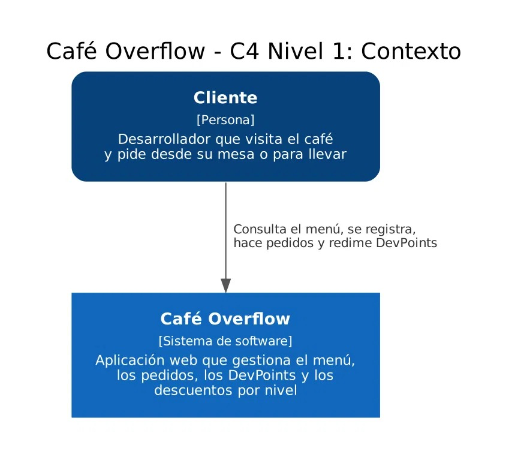
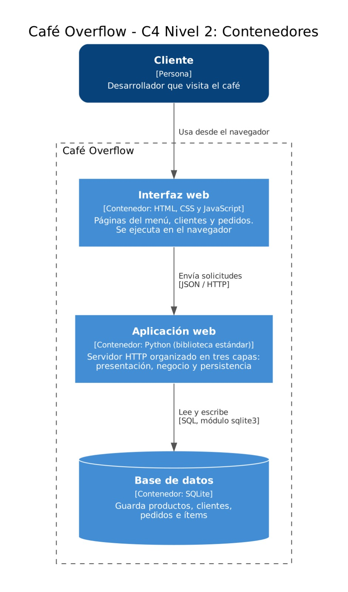
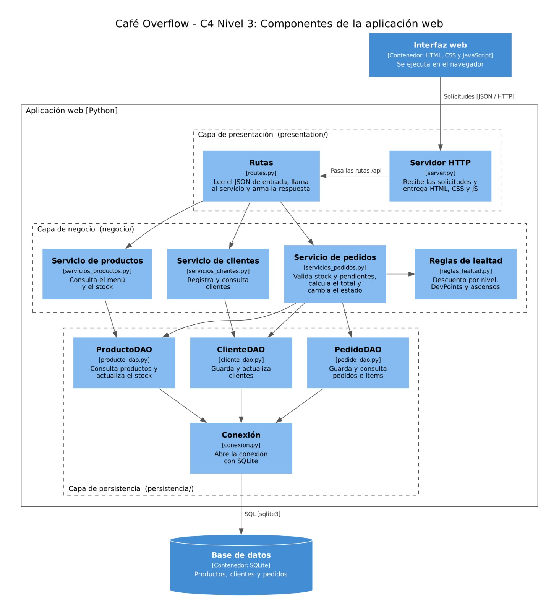

# Café Overflow

Aplicación web para gestionar los pedidos de **Café Overflow – Dev & Coffee Lounge**, un café temático para desarrolladores. Permite consultar el menú, registrar clientes, hacer pedidos, controlar el stock y manejar el programa de lealtad con niveles y DevPoints.

Proyecto del taller **Modelo N-Tier** de Arquitectura de Software (UNAB). Docente: MSc. Feisar Moreno.

## Integrantes

- **Carlos Saúl Villabona**: backend, lógica de negocio y persistencia.
- **Alejandro Jiménez**: frontend e interfaz web.

## Tecnologías

- Frontend: HTML, CSS y JavaScript.
- Backend: Python, solo con la biblioteca estándar.
- Base de datos: SQLite.

No se usó ningún framework ni dependencia externa.

## Arquitectura

La aplicación está dividida en tres capas y cada una solo se comunica con la que tiene debajo:

```text
Navegador (HTML, CSS, JS)
        |
Presentación   ->  presentation/
        |
Negocio        ->  negocio/
        |
Persistencia   ->  persistencia/
        |
SQLite
```

| Capa | Qué hace | Qué no hace |
|---|---|---|
| Presentación | Muestra las páginas, recibe los formularios, atiende las rutas HTTP y arma las respuestas | No calcula totales ni descuentos y no consulta la base de datos |
| Negocio | Calcula totales y descuentos, valida stock y pedidos pendientes, maneja los estados, los DevPoints y los ascensos | No tiene HTML ni SQL |
| Persistencia | Guarda y consulta productos, clientes y pedidos en SQLite | No decide reglas de negocio |

## Estructura del proyecto

```text
cafe-overflow/
├── presentation/
│   ├── server.py            servidor HTTP
│   ├── routes.py            rutas de la API
│   ├── templates/           páginas HTML
│   └── static/              css, js e imágenes
├── negocio/
│   ├── modelos.py
│   ├── reglas_lealtad.py
│   ├── servicios_productos.py
│   ├── servicios_clientes.py
│   └── servicios_pedidos.py
├── persistencia/
│   ├── conexion.py
│   ├── esquema.sql
│   ├── producto_dao.py
│   ├── cliente_dao.py
│   └── pedido_dao.py
├── tests/
│   └── test_reglas_lealtad.py
└── README.md
```

El detalle del frontend está en [presentation/README.md](presentation/README.md).

## Diagramas C4

### Nivel 1: Contexto



### Nivel 2: Contenedores



### Nivel 3: Componentes



## Cómo ejecutar

Se necesita Python 3.10 o superior. No hay que instalar nada más.

1. Clonar el repositorio y entrar a la carpeta:

   ```
   git clone https://github.com/Saulcs-hub/cafe-overflow.git
   cd cafe-overflow
   ```

2. Crear la base de datos (solo la primera vez):

   ```
   python -m persistencia.conexion
   ```

3. Iniciar el servidor:

   ```
   python -m presentation.server
   ```

4. Abrir en el navegador `http://localhost:8000`.

Los comandos se ejecutan desde la carpeta raíz del proyecto. La base se guarda en `persistencia/cafe_overflow.db` y no se sube al repositorio.

Para correr las pruebas:

```
python -m unittest discover -s tests
```

## Rutas de la API

| Método | Ruta | Para qué sirve |
|---|---|---|
| GET | `/api/productos` | Lista los productos con precio y stock |
| POST | `/api/productos` | Crea un producto (`nombre`, `precio`, `stock`) |
| GET | `/api/clientes` | Lista los clientes con nivel, DevPoints y compras acumuladas |
| POST | `/api/clientes` | Registra un cliente (`nombre`, `correo`) |
| GET | `/api/pedidos` | Lista los pedidos |
| POST | `/api/pedidos` | Crea un pedido (`cliente_id`, `items`, `devpoints_a_redimir`) |
| PATCH | `/api/pedidos/{id}/estado` | Cambia el estado de un pedido |

Ejemplo para crear un pedido:

```json
{
  "cliente_id": 1,
  "items": [
    { "producto_id": 2, "cantidad": 3 }
  ],
  "devpoints_a_redimir": 2
}
```

Cuando algo no se puede hacer, la API responde con código 400 y un mensaje:

```json
{ "error": "No hay suficiente stock de Cold Brew." }
```

## Reglas de negocio

**Descuento por nivel**

| Nivel | Descuento | Se alcanza con |
|---|---|---|
| Junior | 5 % | Todo cliente nuevo |
| Mid | 10 % | $500.000 acumulados |
| Senior | 15 % | $1.500.000 acumulados |

**DevPoints**

- Se gana 1 DevPoint por cada $20.000 consumidos en un pedido completado.
- Cada DevPoint vale $200 de descuento en una compra siguiente.

**Validaciones**

- No se puede pedir más cantidad que el stock disponible.
- No se puede crear un pedido si el cliente tiene otro en estado Pendiente de pago.
- No se pueden redimir más DevPoints de los que tiene el cliente.

**Estados del pedido**

```text
Pendiente de pago -> En preparación -> Listo -> Entregado
```

Solo se puede pasar al estado siguiente, no saltar ni devolverse.

## Decisiones que tomamos

El enunciado deja algunas cosas abiertas. Las definimos así:

1. Un pedido se considera completado cuando llega a **Entregado**. En ese momento se actualizan las compras acumuladas, los DevPoints y el nivel del cliente.
2. Primero se aplica el descuento por nivel sobre el subtotal y después el de DevPoints.
3. El descuento por DevPoints nunca supera lo que queda por pagar, así que el total no puede ser negativo.
4. Las compras acumuladas y los DevPoints ganados se calculan con el **total pagado**, es decir, después de los descuentos.
5. El stock se descuenta al registrar el pedido, para no vender dos veces la misma unidad.
6. Los valores se manejan en pesos enteros.

## Ramas

```text
main      versión estable
develop   integración
frontend  trabajo de Alejandro
backend   trabajo de Carlos
```

Cada uno trabaja en su rama y los cambios entran a `develop` por Pull Request. Cuando todo está probado, `develop` pasa a `main`.

## Pendiente

Lo que falta para cerrar la integración entre frontend y backend:

- Crear las tablas y cargar los productos iniciales al arrancar el servidor (hoy la base empieza vacía y los productos se crean con `POST /api/productos`).
- Incluir los productos de cada pedido en `GET /api/pedidos`.
- Permitir que `PATCH /api/pedidos/{id}/estado` avance al estado siguiente sin enviar el estado desde el navegador.
- Agregar `POST /api/pedidos/cotizar` para mostrar el resumen del carrito antes de confirmar.
- Descontar los DevPoints redimidos al crear el pedido y no al entregarlo.
